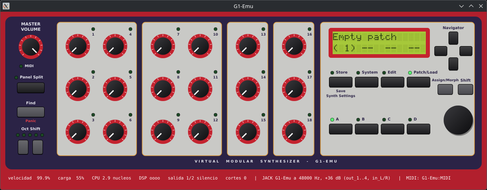

# G1-Emu



**An emulator of the Nord Modular G1** (rack, OS 3.03) built on the
[Gearmulator](https://github.com/dsp56300/gearmulator) core: the hardware's original operating
system runs on an emulated Motorola 68331 and four emulated DSP56303s, and
[Animatek NME](https://github.com/animatek/Animatek-NME) edits it as if it were the real synth.

**Status: pre-alpha.** The OS boots, NME connects over the PC Port and uploads patches, and it
sounds clean in real time: oscillators, filters, envelopes, clocks, effects (chorus, overdrive…),
four outputs and two inputs. It has a window with the panel (display, knobs, buttons and LEDs).
**Runs on Linux**; macOS and Windows build in CI through a JUCE audio and MIDI backend, and the
DSP tests pass on all of them, Apple Silicon and Linux arm64 included. What nobody has done yet is
run either on a real machine, which is what the test builds in
[Releases](https://github.com/animatek/G1-Emu/releases) are for: unsigned, no ROM inside, and we
want to hear what happens ([`docs/release-notes.md`](docs/release-notes.md)). Also missing:
module-by-module testing, and the one panel key whose job is still unknown. The technical details are in [`NOTES.md`](NOTES.md), the plan in
[`ROADMAP.md`](ROADMAP.md) and what changes in [`CHANGELOG.md`](CHANGELOG.md). Contributions are
welcome: see [`CONTRIBUTING.md`](CONTRIBUTING.md).

## You are invited: this is a collaborative project

G1-Emu was started by [Animatek](https://animatek.net), but it is a big project and it is meant to
be built together. **Everyone is warmly invited to take part** — reverse engineering, C++, DSP
code, testing patches against a real G1, recordings, documentation, builds for macOS and Windows,
or simply reporting what sounds wrong. We love collaboration, and every person who joins makes the
emulator bigger and better. There is room for all skill levels: see
[`CONTRIBUTING.md`](CONTRIBUTING.md) and the open tasks in [`ROADMAP.md`](ROADMAP.md), and say
hello in an issue.

## Please read this first

- **Not affiliated with Clavia.** G1-Emu is an independent, open-source project. It is not
  affiliated with, endorsed by or connected to Clavia DMI in any way. "Nord" and "Nord Modular" are
  trademarks of Clavia DMI; they are used here only to say which instrument is emulated.
- **No ROMs, now or ever.** No ROM or firmware is included, and none will be provided. Please do
  not ask for them in issues, e-mails or messages: you will not find them here. You need the 512 KB
  ROM of a Nord Modular rack with OS 3.03 (`Roms/NORD-MODULAR-RACK-VER-3.03.BIN`), dumped from
  your own unit. `Roms/` is ignored by Git and must stay that way.
- **No support.** This is a pre-alpha community project, made in spare time by its maintainer and
  whoever wants to join. There is no support: please do not ask for help, builds or ROMs. Bug
  reports with details, and contributions, are welcome (see [`CONTRIBUTING.md`](CONTRIBUTING.md)).

The window shows this same notice the first time it runs. After that it stays out of the way: it
is always readable in **Settings**, which is also where to put it back at startup.

## Building

Linux (tested on Arch/CachyOS with PipeWire). You need:

- A clone of [gearmulator-md-mm](https://github.com/joelanders/gearmulator-md-mm) in
  `~/src/gearmulator-md-mm` (or `-DGEARMULATOR_DIR=...`). The version tested in CI is
  **`mdmm-v0.1.0-alpha.13`**. The clone is not modified: the core fixes the G1 needs are applied to
  a copy at build time (`cmake/Dsp56300.cmake`).
- ALSA, and JACK (pipewire-jack) for the four outputs and the inputs.
- JUCE for the window and the test bench: by default the one inside Animatek NME next to this repo
  (`../Nomad2026/JUCE`), or `-DG1_JUCE_DIR=...`. Without JUCE only the console version is built.

```bash
cmake -B build -DCMAKE_BUILD_TYPE=Release
cmake --build build -j$(nproc)
```

## Two things a Nord Modular needs, and neither comes in the box

**A G1 makes no sound on its own, and it starts empty.** It is a modular: a patch is what turns it
into an instrument, and without one there is nothing to hear. Real hardware left the factory with
a bank of patches in its flash; G1-Emu cannot give you those, because the ROM carries the
operating system and nothing else — the first time it runs, its flash is built from the OS alone
and every slot says `Empty patch`. **The patches are yours to find or to make.** There are
thousands of `.pch` files out there from twenty-five years of the Nord Modular community: the old
Clavia patch libraries, the Electro-Music archives, and whatever a search turns up. Put them
wherever you like and open them from your editor.

**And to make or load a patch you need an editor.** The G1's own panel edits parameters, not
patches: on the real instrument the patch comes down the PC Port from a computer, and the emulator
is no different. **Any editor that speaks the G1's protocol works** — G1-Emu emulates the
instrument, not one particular editor, and there is nothing in it that prefers one over another:

- **[Animatek NME](https://github.com/animatek/Animatek-NME)** — a modern editor, open source, and
  the one this emulator is developed against, which only means it is the one that gets tested
  first.
- **The original Clavia editor v3.03** — the real thing. It still works, and
  [Stage Engine](https://www.stage-engine.com/) packages it for current macOS with the Wine parts
  bundled in, free with an optional donation, for the G1 and the Micro Modular.
- **[Nomad / NMEdit](https://sourceforge.net/projects/nmedit/)** — the long-running open-source
  Java editor, GPLv2, which also reads and writes `.pch`.
- **[nordmodulareditor.com](https://nordmodulareditor.com)** — another editor project.

If yours is not on the list and it works, say so in an issue and it goes in. If it speaks the
protocol and G1-Emu does not answer it properly, that is a bug here, not in your editor, and we
want to hear about it.

## Using it

```bash
./g1gui.sh   # with the panel in a window
./g1.sh      # in the console (Ctrl+C saves and quits)
```

- **MIDI** (ALSA): client **G1-Emu** with two ports, like the hardware: **PC Port** (the editor:
  choose it in NME as input and output) and **MIDI** (notes and controllers, e.g. from a DAW).
  Programs that read **raw MIDI devices** instead (Bitwig on Linux) see no sequencer port at all:
  for them the emulator takes over a card of its own — a one-port USB MIDI gadget — and links it
  by itself, with nothing to run or route by hand. See [raw MIDI](docs/bitwig-midi.md).
- **Audio** (JACK): `G1-Emu:out_1..out_4` and `in_L`/`in_R`; `out_1`/`out_2` connect themselves to
  the sound card. Without JACK, outputs 1/2 go through ALSA.
- **The ROM** is yours to provide and is looked for in `<Documents>/Animatek/G1-Emu/roms`, in
  `roms/` next to the flash, and in `Roms/` of the current directory and the source tree. With none
  found, the window says what is needed, opens that folder for you, or lets you pick the file;
  `Settings` shows which one is running and changes it. A file that is not the right ROM is told
  apart from a missing one, and the reason is given.
- **Settings** (in the window): the ROM, audio driver and device, output level, whether outputs 1/2
  connect themselves, the raw MIDI card, and the notice above. Saved in `~/.local/share/Animatek/G1-Emu/settings.conf`, which
  the console reads too; the `G1_*` environment variables win over it.
- The flash (installed OS and stored patches) is saved in `~/.local/share/Animatek/G1-Emu/flash.bin`.
- The level is low because the OS itself caps the master volume at −36 dB; it is compensated with
  +36 dB (`G1_GAIN_DB`). More settings in [`CLAUDE.md`](CLAUDE.md).

## License and credits

GPLv3 (see [`LICENSE`](LICENSE)), because it links Gearmulator. Thanks to The Usual Suspects for
[Gearmulator](https://github.com/dsp56300/gearmulator) and to joelanders for the fork with the
Monomachine and Machinedrum, which this work builds on. Made by Animatek
([animatek.net](https://animatek.net)).
